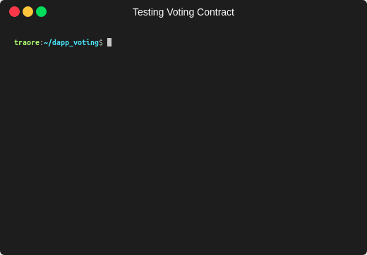

# ⚡️ Suite défi - Système de vote 2

## Tests



### Lors du déploiement

- Le status est "RegisteringVoters"

### Ajout d'un votant

Si la transaction passe, alors

- le mapping ```voters``` est mis à jour
  - ```isRegistered``` passe de ```false``` à ```true```
  - ```index``` passe de ```0``` au```nombre de votant - 1```
- la liste des votants est mis à jour
  - le nouveau votant est mis à la fin de la liste
- l'évènement ```VoterRegistered``` est emit avec l'addresse qui a été ajouté

La transaction revert si

- le ```owner"``` essaye d'ajouter l'addresse 0
- ce n'est pas le ```owner``` du contrat qui essaye d'ajouter le votant
- le votant a dèjà été ajouté
- le ```owner``` essaye d'ajouter le votant pendant une session qui n'est pas la session d'enregistrement des votants

### Retrait d'un votant

Si la transaction passe, alors

- le mapping ```voters``` est mis à jour
  - ```voters[address]``` est réinitialisé
  - la position des votants qui ont été déplacés est mis à jour
- la liste des votants est mis à jour
  - le votant est enlevé de la liste
  - la position des votants qui ont été déplacés est mis à jour
- l'évènement ```VoterUnregistered``` est emit avec l'addresse qui a été supprimé

La transaction revert si

- le ```owner"``` essaye de supprimé un votant qui n'a pas été ajouté
- ce n'est pas le ```owner``` du contrat qui essaye de supprimer le votant
- le votant a dèjà été ajouté
- le ```owner``` essaye de supprimer le votant pendant une session qui n'est pas la session d'enregistrement des votants

### Ajout d'une proposition

Si la transaction passe, alors

- la liste des propositions est mis à jour
  - la nouvelle ```Proposal``` est ajouté à la fin de la liste
    - avec ```voteCount``` egal à ```0```
- l'évènement ```ProposalRegistered``` est emit avec l'identifiant de la proposition

La transaction revert si

- le ```voter"``` essaye d'ajouter proposition vide
- ce n'est pas un ```voter``` du contrat qui essaye d'ajouter la proposition
- la proposition a dèjà été ajoutée
- le ```voter``` essaye d'ajouter la proposition pendant une session qui n'est pas la session d'enregistrement des propositions

### Vote

Si la transaction passe, alors

- ```hasVoted``` du votant passe à ```true```
- ```voteCount``` est incrémenté de ```1```
- l'évènement ```Voter``` est emit avec l'addresse du votant et l'identifiant de la proposition

La transaction revert si

- le ```voter"``` essaye d'ajouter proposition vide
- ce n'est pas un ```voter``` du contrat qui essaye de voter
- le ```voter``` a dèjà voté
- le ```voter``` vote pour une proposition qui n'existe pas
- le ```voter``` essaye de voter pendant une session qui n'est pas la session de vote

### Récupération de la proposition gagnante

Si la transaction passe, alors

- c'est la bonne proposition qui est récupéré
  - c'est le bon id
  - c'est la bonne description
  - c'est le bon nombre de vote

La transaction revert si

- on essaye de récupérer la proposition gagnante alors que les votes n'ont pas été comptabilisés

### Changement de session

Les fonctions concerné

- openProposalRegistrationSession
- closeProposalRegistrationSession
- openVotingSession
- closeVotingSession
- tallyVotes

Si la transaction passe, alors

- le ```status``` est mis à jour
  - ```openProposalRegistrationSession``` change le status par ```ProposalsRegistrationStarted```
  - ```closeProposalRegistrationSession``` change le status par ```ProposalsRegistrationEnded```
  - ```openVotingSession``` change le status par ```VotingSessionStarted```
  - ```closeVotingSession``` change le status par ```VotingSessionEnded```
  - ```tallyVotes``` change le status par ```VotesTallied```
- un évènement ```VoterUnregistered``` est emit
  - ```openProposalRegistrationSession``` emet l'évènement ```ProposalsRegistrationStarted```
  - ```closeProposalRegistrationSession``` emet l'évènement ```ProposalsRegistrationEnded```
  - ```openVotingSession``` emet l'évènement ```VotingSessionStarted```
  - ```closeVotingSession``` emet l'évènement ```VotingSessionEnded```
  - ```tallyVotes``` emet l'évènement ```VotesTallied```
- l'évènement ```WorkflowStatusChange``` est emit avec le précédent status et le nouveau status

La transaction revert si

- ce n'est pas le ```owner``` du contrat qui essaye de changer le status
- le ```owner``` essaye de changer le status pendant une session qui n'est pas la bonne
  - ```openProposalRegistrationSession``` revert si le status n'est pas ```RegisteringVoters```
  - ```closeProposalRegistrationSession``` revert si le status n'est pas ```ProposalsRegistrationStarted```
  - ```openVotingSession``` revert si le status n'est pas ```ProposalsRegistrationEnded```
  - ```closeVotingSession``` revert si le status n'est pas ```VotingSessionStarted```
  - ```tallyVotes``` revert si le status n'est pas ```VotingSessionEnded```

### Exemple de cas

Dans ce test,

- ```owner``` ajoute des votants
- ```owner``` ouvre la session d'enregistrement des propositions
- les ```voters``` ajoute des propositions
- ```owner``` ferme la session d'enregistrement des propositions
- ```owner``` ouvre la session d'enregistrement des votes
- les ```voters``` votent
- ```owner``` ferme la session d'enregistrement des votes
- ```owner``` compte les vote

À la fin, on vérifie que c'est la bonne proposition qui a gagné avec le bon nombre de vote.
